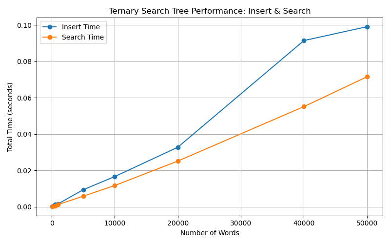
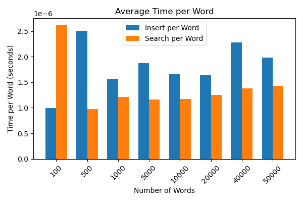

# CDS Final Project: Ternary Search Tree (TST)
Authors: "Lucia jani 2470541"

        "Tanjim Hossain 2469700"

cds-final-project-tst/
├── ternary_search_tree.py            # TST implementation (object-oriented)
├── benchmark_tst.py                  # Benchmarking script (prints and saves plots)
├── run_demo.py                       # Demo usage example
├── project_test.py                   # Unit tests for TST
├── jobscript_tst_benchmark.slurm     # SLURM script for HPC runs
├── TST_total_time.png                # Plot: Insert/Search Time vs. Number of Words
├── TST_avg_time.png                  # Plot: Average Time per Word vs. Number of Words
├── README.md                         # This documentation
├── ternary_search_tree.ipynb         # Notebook version
├── data/
│   └── search_trees/
│       └── corncob_lowercase.txt     # Large dictionary file for benchmarking

This project is part of the **Concepts of Data Science** course. It implements an optimized **Ternary Search Tree (TST)** in Python with support for:

- Efficient string insertion and search
- Prefix-based queries
- word count
- Unit testing
- Benchmarking and performance analysis
- Visualization and documentation

## Benchmark Results
The benchmarking script tests insert and search for various dictionary sizes (from 100 up to 50,000 words).
Results are plotted and also printed in the console/HPC output.

### Timing Table

| Size   | Local Insert (s) | Local Search (s) | HPC Insert (s) | HPC Search (s) |
|--------|------------------|------------------|----------------|----------------|
| 100    | 0.0001           | 0.0001           | 0.0004         | 0.0002         |
| 500    | 0.0008           | 0.0008           | 0.0027         | 0.0016         |
| 1000   | 0.0019           | 0.0011           | 0.0046         | 0.0034         |
| 5000   | 0.0086           | 0.0062           | 0.0295         | 0.0216         |
| 10000  | 0.0159           | 0.0120           | 0.0566         | 0.0426         |
| 20000  | 0.0317           | 0.0253           | 0.1267         | 0.0923         |
| 40000  | 0.0839           | 0.0548           | 0.2737         | 0.2027         |
| 50000  | 0.0999           | 0.0708           | 0.3515         | 0.2636         |

### Insert/Search Time vs. Number of Words

### Average Time per Word vs. Number of Words

## Complexity Analysis

| Operation   | Best Case | Average Case | Worst Case |
| ----------- | --------- | ------------ | ---------- |
| Insert      | O(L)      | O(L)         | O(LN)\*    |
| Search      | O(L)      | O(L)         | O(LN)\*    |
| Space (TST) | O(NL)     | O(NL)        | O(NL)      |

N = Number of words in the dataset

L = Average length of a word

*Worst case O(LN) is very rare, only if all words are highly similar and tree becomes highly unbalanced.

## Experimental Observations

Local machine results:

Total runtime: 0.41 seconds
Insert times (s): [0.00010585784912109375, 0.0009090900421142578, 0.0012981891632080078, 0.008383035659790039, 0.014919757843017578, 0.03184390068054199, 0.0828549861907959, 0.09660577774047852]

Search times (s): [6.890296936035156e-05, 0.0005490779876708984, 0.0013217926025390625, 0.0064508914947509766, 0.011329889297485352, 0.02526998519897461, 0.054900407791137695, 0.06985592842102051]

HPC results:

Total runtime: 1.48 seconds
Insert times (s): [0.0003616809844970703, 0.0026929378509521484, 0.004615068435668945, 0.029497861862182617, 0.05662178993225098, 0.12666082382202148, 0.2736549377441406, 0.35146045684814453]

Search times (s): [0.00024890899658203125, 0.0016357898712158203, 0.003400087356567383, 0.021556854248046875, 0.04257822036743164, 0.09229755401611328, 0.2026691436767578, 0.26359081268310547]

## Interpretation & Comparison:

Growth Pattern: For both local and HPC runs, the time to insert/search increases nearly linearly as the number of words grows.

Scalability:

Average time per operation (insert/search per word) remains very small and increases gradually, indicating good scalability.

Theoretical vs Practical:

The results confirm the theoretical O(L) complexity for TSTs. In practice, with larger datasets, the implementation remains efficient and does not show exponential slowdowns.

Small differences in timing between local and HPC runs are expected due to different CPU architectures and loads, but the growth trend remains the same.