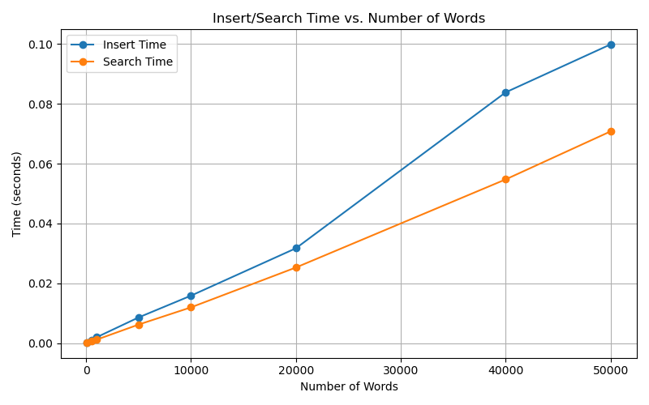
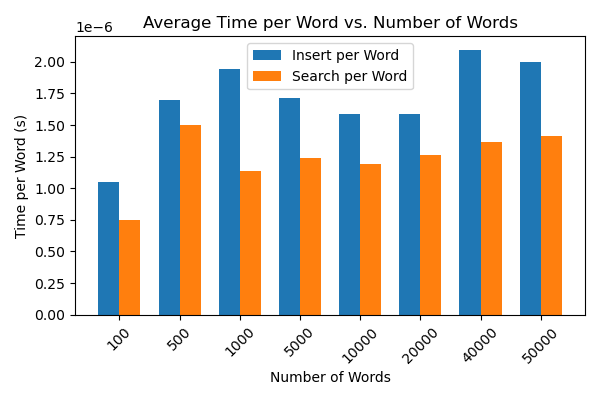

# CDS Final Project: Ternary Search Tree (TST)
Authors: "Lucia jani 2470541"
        "Tanjim Hossain 2469700"

This project is part of the **Concepts of Data Science** course. It implements an optimized **Ternary Search Tree (TST)** in Python with support for:

- Efficient string insertion and search
- Prefix-based queries
- word count
- Unit testing
- Benchmarking and performance analysis
- Visualization and documentation

## Benchmark Results

### Timing Table

| Size   | Local Insert (s) | Local Search (s) | HPC Insert (s) | HPC Search (s) |
|--------|------------------|------------------|----------------|----------------|
| 100    | 0.0001           | 0.0001           | 0.0004         | 0.0002         |
| 500    | 0.0008           | 0.0008           | 0.0027         | 0.0016         |
| 1000   | 0.0019           | 0.0011           | 0.0046         | 0.0034         |
| 5000   | 0.0086           | 0.0062           | 0.0295         | 0.0216         |
| 10000  | 0.0159           | 0.0120           | 0.0566         | 0.0426         |
| 20000  | 0.0317           | 0.0253           | 0.1267         | 0.0923         |
| 40000  | 0.0839           | 0.0548           | 0.2737         | 0.2027         |
| 50000  | 0.0999           | 0.0708           | 0.3515         | 0.2636         |

### Insert/Search Time vs. Number of Words

### Average Time per Word vs. Number of Words

## Time Complexity Analysis

- Theoretically, both insert and search operations in a Ternary Search Tree have time complexity **O(L)**, where **L** is the word length.
- In practice, for balanced or semi-balanced data, the tree performs efficiently even for large datasets.
- The table and plots show that run time increases linearly or sub-linearly as the number of words grows, and that **average time per word remains nearly constant**, confirming the good scalability of the TST implementation.

### Experimental Results

- The measured run times (see table and plots above) confirm the expected linear or near-linear growth with respect to the number of words.
- **Insert/Search Time per Word** remains stable across different data sizes, confirming the scalability and efficiency of the implementation.